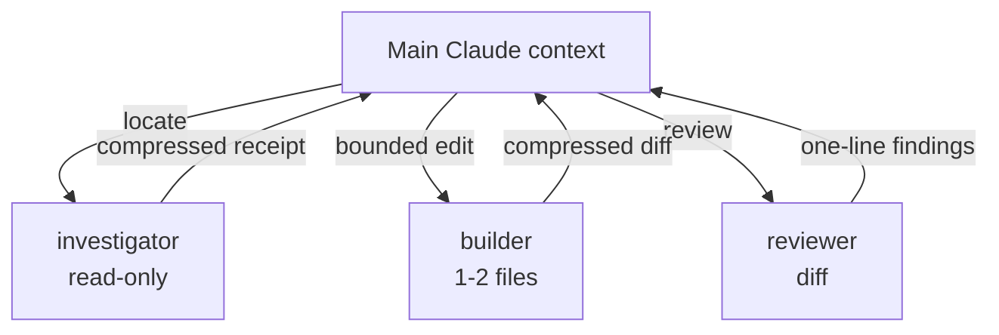

# cavecrew

  

Delegate bounded work to three caveman-compressed subagents instead of doing it inline. Their output is compressed, so the tool-result injected back into your main context is ~60% smaller — your context lasts longer across long sessions.

## How it works

## What's inside

- **cavecrew-investigator** — read-only code locator. Returns a `file:line` table for "where is X defined", "what calls Y", "list all uses of Z", "map this directory". Refuses to suggest fixes.
- **cavecrew-builder** — surgical 1–2 file edit. Typos, single-function rewrites, mechanical renames, format-preserving tweaks. Hard-refuses 3+ file scope.
- **cavecrew-reviewer** — diff / branch / file reviewer. One line per finding, severity-tagged, no praise, no scope creep.

Plus the **cavecrew** skill — a decision guide for WHEN to spawn each subagent instead of doing the work inline or using a vanilla explore agent.

## Why

Vanilla subagents dump whole files back into your main context. These three return compressed, structured results — the main thread eats far fewer tokens, so a long session doesn't blow its context window.

## Install

Add via a Claude Code plugin marketplace, then `/plugin install cavecrew`.

## License

MIT
